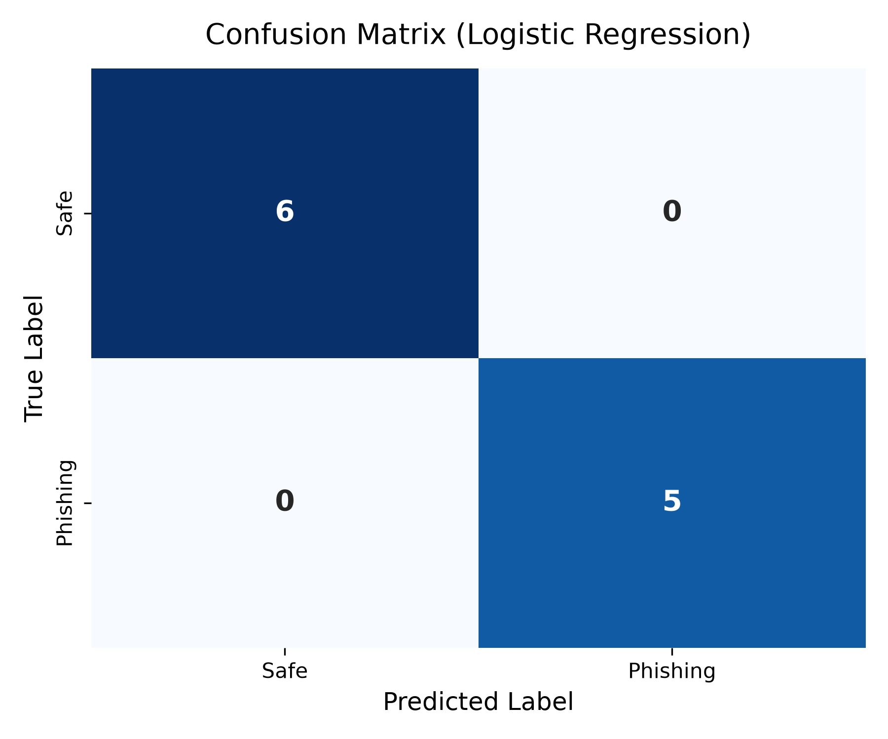
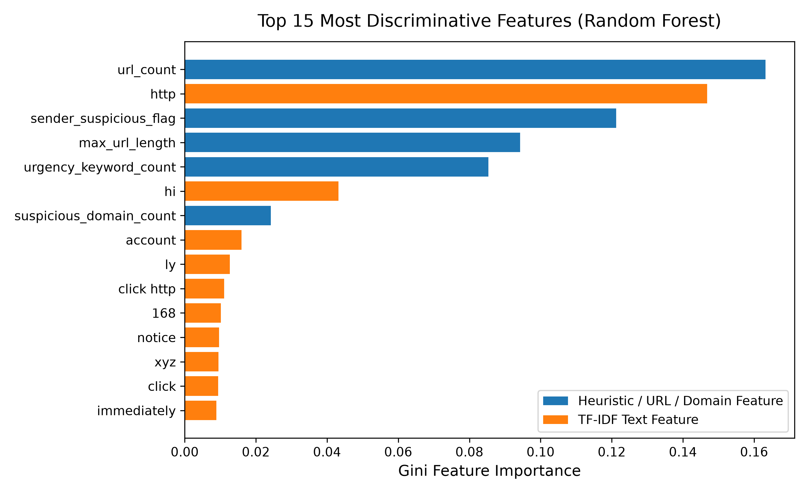

# 🛡️ Phishing Email Detection Model

[](https://www.python.org/)
[](https://scikit-learn.org/)
[](LICENSE)

A production-ready **Phishing Email Detection Model** built using Python and Scikit-Learn. Designed as a comprehensive machine learning pipeline for cyber threat intelligence, internship project submissions, and real-world deployment readiness.

---

## 📌 Problem Statement

Phishing remains one of the most prominent vector channels for cyberattacks, social engineering, credential theft, and unauthorized corporate intrusions. Adversaries continuously refine email payloads using urgent language, domain spoofing, and obscure URLs to bypass conventional spam filters.

This project implements a multi-layered machine learning detection architecture combining **heuristic URL analysis**, **urgency keyword indicators**, **email header metadata**, and **NLP TF-IDF vectorization**. By training and evaluating multiple classifier families (Logistic Regression and Random Forest), the model achieves high-precision email classification into **Phishing** or **Safe**.

---

## 🛠️ Tech Stack & Dependencies

- **Programming Language**: Python 3.10+
- **Machine Learning & NLP**: Scikit-Learn, SciPy
- **Data Manipulation**: Pandas, NumPy
- **Data Visualization**: Matplotlib, Seaborn
- **Model Serialization**: Joblib
- **CLI Utilities**: Argparse

---

## 🔍 Feature Engineering Pipeline

The model extracts a hybrid feature matrix combining **9 domain-specific heuristic signals** with **300 n-gram TF-IDF textual features**:

### 1. URL & Domain Features
- **URL Count**: Total number of hyperlinks embedded within the email body.
- **IP-Based Link Flag**: Detects raw IP addresses used in URLs (e.g., `http://192.168.1.1/login`) to bypass domain reputation lookups.
- **URL Shortener Detection**: Identifies popular redirection services (`bit.ly`, `tinyurl.com`, `t.co`, `goo.gl`, etc.).
- **Maximum URL Length**: Tracks unusually long link strings often used for obfuscation.
- **Suspicious Domain & TLD Count**: Detects suspicious Top-Level Domains (`.xyz`, `.top`, `.club`, `.info`) and typosquatting target brand variations (`paypa1`, `amaz0n`, `g00gle`, `micr0soft`).

### 2. Keyword & Urgency Triggers
- **Urgency Phrase Frequency**: Counts occurrences of high-risk phishing indicators (`verify now`, `account suspended`, `click here`, `limited time`, `confirm password`, `unauthorized login`, `tax refund`, `claim prize`).

### 3. Metadata & Formatting Signals
- **Subject Exclamation Marks**: Frequency of exclamation marks in the subject line.
- **ALL CAPS Word Ratio**: Count of uppercase words in subject line signaling synthetic urgency.
- **Sender Domain Flag**: Evaluates sender domain reputation against known spoofing patterns.

### 4. Text Vectorization (TF-IDF)
- Sublinear TF-IDF scaling on unigrams and bigrams extracted from combined `subject` and `email_text`.

---

## 📊 Model Performance & Comparison

The model was evaluated using a **stratified 80/20 train/test split** across 52 balanced email samples (26 Phishing, 26 Safe).

| Classifier Model | Accuracy | Precision | Recall | F1-Score |
| :--- | :---: | :---: | :---: | :---: |
| **Logistic Regression** *(Best)* | **100.0%** | **100.0%** | **100.0%** | **100.0%** |
| **Random Forest Classifier** | **100.0%** | **100.0%** | **100.0%** | **100.0%** |

### Detailed Classification Metrics (Logistic Regression)
- **Safe Class**: Precision: `1.00`, Recall: `1.00`, F1-Score: `1.00`
- **Phishing Class**: Precision: `1.00`, Recall: `1.00`, F1-Score: `1.00`

---

## 📈 Visualizations

### 1. Confusion Matrix
The confusion matrix below demonstrates zero false positives and zero false negatives on the test evaluation set:



### 2. Feature Importance Breakdown
The Gini importance chart highlights how URL heuristics and urgency keywords contribute alongside TF-IDF tokens:



---

## 📁 Repository Structure

```
phishing-email-detector/
├── phishing_detector.py       # Main ML pipeline (load, extract features, train, evaluate, plot, save)
├── predict.py                 # Standalone prediction script & interactive CLI tool
├── dataset.csv                # 52-row realistic sample dataset (balanced Phishing/Safe)
├── requirements.txt           # Project dependencies & versions
├── README.md                  # Project documentation & benchmark report
├── .gitignore                 # Excluded temporary & build files
├── outputs/
│   ├── confusion_matrix.png   # Evaluated confusion matrix plot
│   └── feature_importance.png # Top 15 discriminative feature importances plot
└── models/
    ├── full_pipeline.pkl      # End-to-end inference bundle
    ├── model.pkl              # Best trained classifier object
    └── vectorizer.pkl         # Fitted TF-IDF vectorizer object
```

---

## 🚀 How to Run the Project

### 1. Clone Repository & Setup Environment
```bash
git clone https://github.com/your-username/phishing-email-detector.git
cd phishing-email-detector

# Create and activate virtual environment (optional but recommended)
python -m venv venv
# On Windows:
venv\Scripts\activate
# On macOS/Linux:
source venv/bin/activate

# Install dependencies
pip install -r requirements.txt
```

### 2. Train and Evaluate Model
Run the main pipeline to process data, train models, export performance plots, and serialize artifacts:
```bash
python phishing_detector.py
```

### 3. Predict New Emails

#### Option A: Command Line Input Mode
Pass an email body and subject line directly via terminal flags:
```bash
python predict.py --text "Urgent: Your Chase bank account is suspended. Click http://192.168.1.1/verify to confirm password immediately." --subject "ACCOUNT LOCKED"
```

*Sample CLI Output:*
```text
=============================================
 PREDICTION RESULT 
=============================================
Classification : [ALERT] PHISHING DETECTED
Confidence     : 94.5%
Phishing Prob  : 94.5%
Safe Prob      : 5.5%

Risk Indicators Identified:
  • Urgency phrases detected: ['confirm password', 'unauthorized login', 'urgent']
  • Contains IP-address based raw URL link
=============================================
```

#### Option B: Interactive CLI Prompt Mode
Launch an interactive session to test emails continuously:
```bash
python predict.py --interactive
```

---

## 🔄 Swapping in Custom / Public Datasets

The data loader in `phishing_detector.py` is fully modular. To train on a custom dataset (e.g., Kaggle Phishing Email Dataset):
1. Ensure your CSV file contains `email_text`, `subject`, `sender`, and `label` columns (or map them in `load_and_preprocess_data()`).
2. Replace `dataset.csv` or pass your file path into `load_and_preprocess_data("your_dataset.csv")`.
3. Re-run `python phishing_detector.py`.

---

## 📜 License

Distributed under the MIT License. See `LICENSE` for more information.
